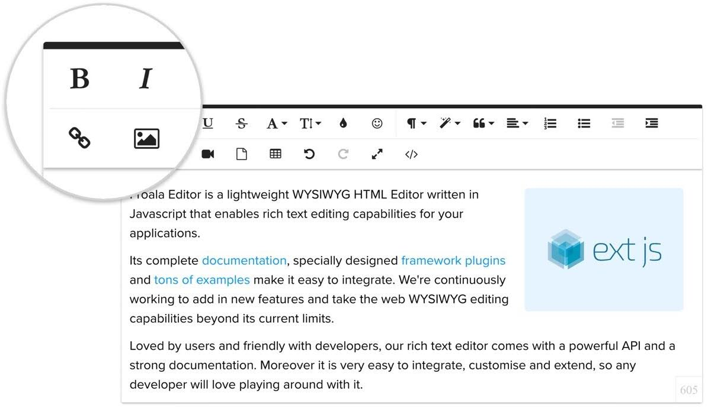

# ExtReact Froala Example

This project demonstrates the use of the Froala Editor inside an ExtReact app.



## Froala
Froala is a WYSIWYG HTML Editor. [https://www.froala.com/wysiwyg-editor](https://www.froala.com/wysiwyg-editor?utm_source=sencha-ext-react-froala-example&utm_medium=referral)

It's a beautiful Javascript web editor that's easy to integrate for developers and your users will simply fall in love with its clean design.

Find more on the [Froala React integration here](https://www.froala.com/wysiwyg-editor/docs/framework-plugins/react?utm_source=sencha-ext-react-froala-example&utm_medium=referral).

## Running this Example
There are two steps to run this example. 

* Run `npm install`
* Run `npm start` or start the VSCode launcher.


## New Projects
Follow these steps for integrating Froala into your new project.   

### Create a ExtReact Project
Use this [guide to create](https://docs.sencha.com/extreact/6.6.0/guides/getting_started.html) an ExtReact project.

### NPM Dependencies
Add the Froala and ancilary dependencies to your project. 

Run `npm install -g react-froala-wysiwyg css-loader url-loader file-loader --save` to add the depencencies automatically.

### Configure Webpack
Add the Jquery plugin and loaders to your webpack 4+ config for the Froala editor. 

Step 1: Add the jquery plugin. [See ./webpack.config.js](./webpack.config.js)
```
new webpack.ProvidePlugin({
  $: "jquery",
  jQuery: "jquery"
})
```

Step 2: Add the loaders. [See ./webpack.config.js](./webpack.config.js)
```
{
  test: /\.woff(\?v=\d+\.\d+\.\d+)?$/,
  use: "url-loader?limit=10000&mimetype=application/font-woff"
}, {
  test: /\.woff2(\?v=\d+\.\d+\.\d+)?$/,
  use: "url-loader?limit=10000&mimetype=application/font-woff"
}, {
  test: /\.ttf(\?v=\d+\.\d+\.\d+)?$/,
  use: "url-loader?limit=10000&mimetype=application/octet-stream"
}, {
  test: /\.eot(\?v=\d+\.\d+\.\d+)?$/,
  use: "file-loader"
}, {
  test: /\.svg(\?v=\d+\.\d+\.\d+)?$/,
  use: "url-loader?limit=10000&mimetype=image/svg+xml"
}
```

### Application Integration
Add the editor to your app. [See AppFroala.js](./src/AppFroala.js)

```
import React from 'react'
import 'froala-editor/js/froala_editor.pkgd.min.js'
import 'froala-editor/css/froala_style.min.css'
import 'froala-editor/css/froala_editor.pkgd.min.css'
import 'font-awesome/css/font-awesome.css'
import FroalaEditor from 'react-froala-wysiwyg'
import { Panel } from '@sencha/ext-modern'

var divStyle = {
  height: '100%',
  width: '100%',
  background: 'gray'
};

var config = {
  placeholderText: 'Froala as an ExtReact Component!'
}

export default function AppFroala() {
  return (
    <Panel title="ExtReact with Froala Editor" layout="fit">
      <div style={divStyle}>
        <FroalaEditor tag='textarea' config={config} />
      </div>
    </Panel>
  )
}
```
