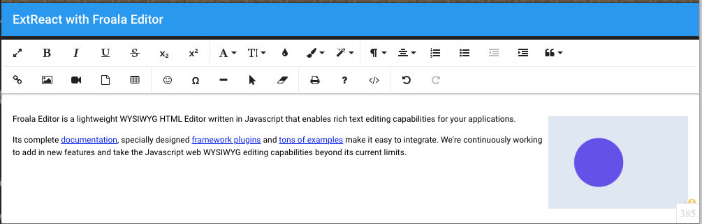

# ExtReact Froala Example

This project demonstrates the use of the Froala Editor inside an ExtReact app.

## Froala
Froala is a WYSIWYG HTML Editor. https://www.froala.com/wysiwyg-editor

It's a beautiful Javascript web editor that's easy to integrate for developers and your users will simply fall in love with its clean design.

Find more on the [Froala React integration here](https://www.froala.com/wysiwyg-editor/docs/framework-plugins/react).

## Running this Example
There are two steps to run this example. 

* Run `npm install`
* Run `npm start` or start the VSCode launcher.
