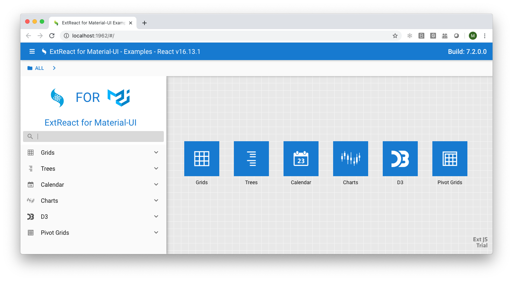

# ExtReact for Material-UI

Welcome to ExtReact for Material-UI, a collection of data-centric, React components that are the perfect compliment to [Material-UI.com](https://material-ui.com/)

### Currently ExtReact for Material-UI is delivered to customers through the general ExtReact product.

Click here to [Get Started with ExtReact for Material-UI](https://github.com/sencha/ext-react/blob/ext-react-7.2.1/packages/ext-react-material-ui/guides/ExtReact_for_Material-UI_GETTING_STARTED.md)

## Resources

- [Getting Started](https://github.com/sencha/ext-react/blob/ext-react-7.2.1/packages/ext-react-material-ui/guides/ExtReact_for_Material-UI_GETTING_STARTED.md)
- [Getting Started - Detailed Version](https://github.com/sencha/ext-react/blob/ext-react-7.2.1/packages/ext-react-material-ui/guides/ExtReact_for_Material-UI_GETTING_STARTED_DETAILED.md)
- [Adding to existing Material-UI Application](https://github.com/sencha/ext-react/blob/ext-react-7.2.1/packages/ext-react-material-ui/guides/ExtReact_for_Material-UI_ADDING.md)
- [Examples](https://examples.sencha.com/ExtReact/7.3.0/ext-react-material-ui-documentation/)
- [ExtReact for Material UI Documentation](https://examples.sencha.com/ExtReact/7.3.0/ext-react-material-ui-documentation/)
- [Material UI Documentation](https://material-ui.com/)